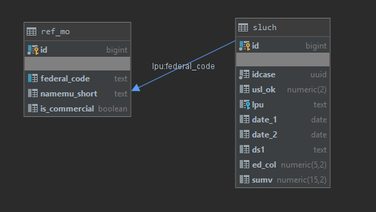

# Описание
## Структура таблицы sluch:

``` sql
create table sluch
(
    idcase                  uuid      not null,
    usl_ok                  numeric(2),
    lpu                     text references ref_mo (federal_code),
    date_1                  date,
    date_2                  date,
    ds1                     text,
    ed_col                  numeric(5, 2),
    sumv                    numeric(15, 2),
    id                      bigserial not null
        constraint pk_sluch primary key
);

comment on table sluch is 'Сведения о случае';
comment on column sluch.idcase is 'Уникальный идентификатор в реестре случаев';
comment on column sluch.usl_ok is 'Условия оказания медицинской помощи';
comment on column sluch.lpu is 'МО выполнившая МП';
comment on column sluch.date_1 is 'Дата начала лечения';
comment on column sluch.date_2 is 'Дата окончания лечения';
comment on column sluch.ds1 is 'Диагноз основной';
comment on column sluch.ed_col is 'Количество единиц оплаты медицинской помощи';
comment on column sluch.sumv is 'Сумма, выставленная к оплате';

```

## Структура таблицы ref_mo:
``` sql
create table ref_mo
(
    id               bigserial not null
        constraint pk_ref_mo_oms
            primary key,
    federal_code     text unique,
    namemu_short     text,
    is_commercial    boolean
);

comment on table ref_mo is 'Справочник МО ОМС';
comment on column ref_mo.federal_code is 'Федеральный код МО';
comment on column ref_mo.namemu_short is 'Наименование МО';
comment on column ref_mo.is_commercial is 'Признак коммерческой организации';
```

## ER-диаграмма:


## Примеры строк таблицы sluch

| id | idcase | usl_ok | lpu | date_1 | date_2 | ds1 | ed_col | sumv |
| -- | ------ | ------ | --- | ------ | ------ | --- | ------ | ---- |
| 1 |fff77bae-05fb-11ea-9a22-00e081c65467| 3 | 810107 | 2019-11-13 | 2019-11-13 | Z01.7 | 0.00 | 339.48 |
| 2 | ffc26042-079d-11ea-8988-00e081c65467 | 3 | 810107 | 2019-11-15 | 2019-11-15 | I48.0 | 1.00 |1106.27|
| 3 | ff3ddc80-1258-11ea-806c-00e081c65467 | 1 | 810107 | 2019-11-27 | 2019-11-29 | K31.7 | 1.00 |72959.11|
| 4 | ff0a68b0-05eb-11ea-aab4-00e081c65467 | 3 | 810107 | 2019-11-13 | 2019-11-15 | Z01.7 | 0.00 |2798.00|
| 5 | ff03a640-069c-11ea-928b-00e081c65467 | 3 | 810107 | 2019-11-13 | 2019-11-13 | Z01.7 | 0.00 |142.72|
| 6 | fe9c1f18-046f-11ea-82eb-00e081c65467 | 3 | 810107 | 2019-11-11 | 2019-11-11 | Z01.7 | 0.00 |1023.12|
| 7 | fdc06622-015d-11ea-941d-00e081c65467 | 1 | 810107 | 2019-10-29 | 2019-11-07 | J31.0 | 1.00 |33205.75|
| 8 | fd38f832-078d-11ea-ab2e-00e081c65467 | 3 | 810107 | 2019-11-15 | 2019-11-15 | Z01.7 | 0.00 |486.03|

## Примеры строк таблицы ref_mo

| id | federal_code | namemu_short | is_commercial |
| -- | ------------ | ------------ | ------------- |
| 4011907102 | null | Государственное предприятие Ханты-Мансийского автономного округа "Аптечная база" | null |
| 233 | 810004 | БУ "Нижневартовская городская больница" | null |
| 123 | 9085 | Муниципальное учреждение  здравохранения "Цингалинская амбулатория " п.Цингалы  Ханты- Мансийского района| false |
| 95 | 810149 | Сургутская больница ФГБУЗ ЗСМЦ ФМБА России	| null |
| 239 | 810216 | Общество с ограниченной ответственностью "Диалам" | false |
| 122 | 810177 | ЛПЧУ "ЗдоровьЕ" | false |
| 228 |	810161 | ООО "Медсервис" | true |
| 231 |	810189 | ООО "Вира - Центр" | true |
| 76 | 810107 | БУ "Няганская окружная больница" | false |


# Задания по SQL
## 1. Напишите запрос, в котором посчитана общая сумма, выставленная к оплате по МО " БУ "Няганская окружная больница" "
***
## 2. Напишите запрос, в котором будут найдены все строки таблицы sluch, для которых не нашлось МО в таблице ref_mo
***
## 3. Напишите запрос, в котором будут найдены все строки таблицы sluch, для которых МО, выполнившее МП, начинается с цифры "8"
***
## 4. Вы обнаружили, что следующий запрос медленно работает. Как его изменить, чтобы скорость работы запроса была увеличена?
``` sql
select *
from sluch
where lpu in (select federal_code from ref_mo where is_commercial = true);
```
***
## 5. Напишите запрос, в котором будут выбраны все строки таблицы sluch, где дата окончания лечения между 11 мая 2020 года и 28 мая 2020 года
***
## 6. Напишите запрос, в котором будут выбраны все строки таблицы sluch, где год даты окончания лечения равен 2019
***
## 7. Разработчик для оптимизации запроса сделал следующий индекс:
``` sql
create index idx_sluch_ds1 on sluch(ds1)
```
## Будет ли применён индекс для запроса:
``` sql
select *
from sluch
where lower(ds1) = 'z01.7'
```
***
## 8. Напишите запрос, в котором для каждой строки таблицы sluch будет посчитано общее количество единиц оплаты медицинской помощи в разрезе МО
***
## 9. Необходимо найти уникальные основные диагнозы, которые есть как у МО = '810107', так и у МО = '810125' 
***
# Вопросы по Jasper
## Умеете ли вы создавать каскадные фильтры в Jasper?
***
## Какие могут быть проблемы при выгрузке отчёта в формате PDF из Jasper?
***
## Где расположены логи Jasper сервера?
***
## Что можно указать в основном Dataset Jasper отчёта, если в основном Dataset Jasper отчёта никакой запрос не формируется, а используются только Subdatasets
***
# Общие вопросы
## Должна ли храниться бизнес-логика на стороне БД или приложения?
***
## Какие методы оптимизации запросов вы знаете?
***
## Чем отличается Right join от Left join?
***
## Что можно сделать для удобства работы с запросом, который часто встречается?